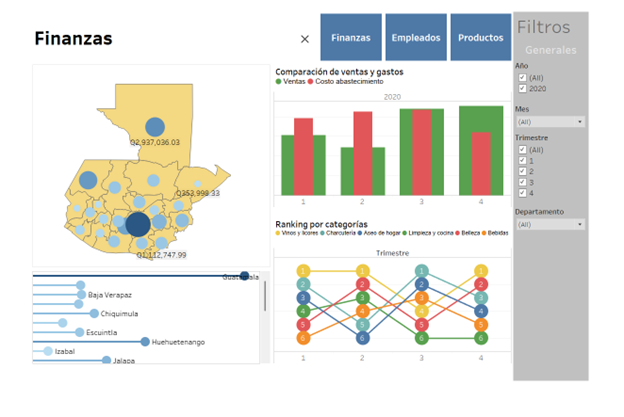
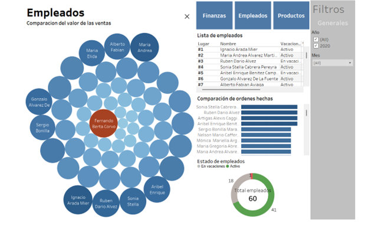
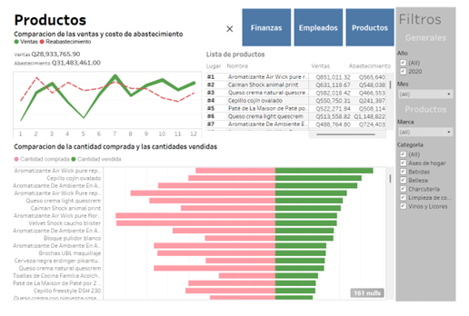

<h1>Descripción</h1>

En este proyecto se realizó un ETL sobre 6 archivos de texto. El contenido de los arhivos de texto fue limpiado, organizado y normalizado para realizar análisis útiles. 
  Para el ETL se utilizó SSIS (SQL Integration Services) que guardaba todos los datos transformados en una base de datos de SQL Server. Con estos datos se crearon diagramas y 
  dashboards para analizar los datos.
 
  <h2>Dashboards</h2> 
  
Se crearon 3 dashboards cada uno con los diagramas de su respectiva área, todos explicados en la sección anterior. Los dashboards son: Finanzas, Empleados y Productos. 
    Cada uno incluye filtros y jerarquías para que el usuario encuentra la información relevante para él. Además, se agregaron botones de navegación para que los usuarios cambian 
    rápidamente al dashboard que les interesa. Los encabezados de las medidas no se muestran por cuestión de ahorrar espacio. Algunos Viz se configuraron para usar sus 
    elementos como filtros. A continuación, se muestran los diagramas:
 
    <h3>Finanzas</h3> 
    
    <h3>Empleados</h3> 
    
    <h3>Productos</h3> 
    
